# Runelite Save Replay Buffer For OBS Plugin

This plugin is designed to automatically save any existing OBS Replay Buffer.

> Disclaimer: this project is not developed, maintained, affiliated or otherwise endorsed by OBS or the OBS Project

## Usage

Apart from installing from the Runelite Plugin Hub, this plugin requires:

- [Open Broadcaster Software (OBS) v28+](https://obsproject.com/).
- OBS configured with an active Replay Buffer (File -> Settings -> Output -> [Setup Replay Buffer as desired])
- OBS WebSocket server running with auth (Tools -> WebSocket Server Settings -> [Enable Server] and [Generate Password])

Once configured, add the credentials in the RuneLite settings and turn on the plugin. 

Once enabled, the plugin will immediately attempt to open a connection to the OBS WebSocket Server, 
you can see the session listed in OBS in the "WebSocket Server Settings".

## Detailed setup instructions

Below is a more detailed step-by-step guide for plugin setup, with reference pictures.

### 1. Install the Plugin

Open the RuneLite Plugin Hub.

Search for Replay Buffer (OBS).

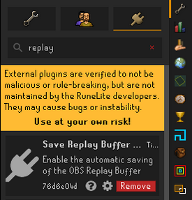

Click Install.

### 2. Check Your OBS Version

You must be using OBS version 28 or higher.

To check: Go to Help → About

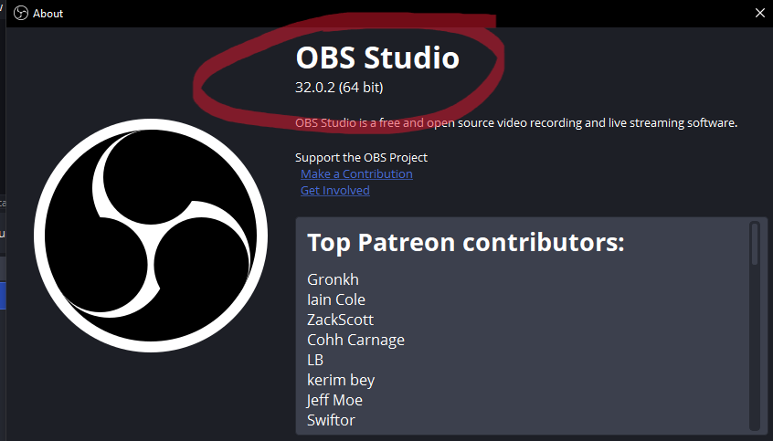

You can also see the version number in the top-left corner of OBS.

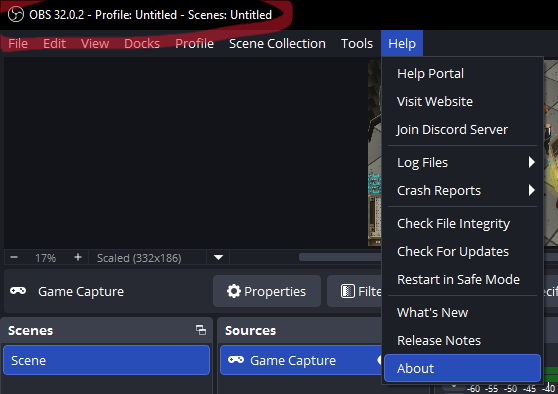

### 3. Enable the Replay Buffer in OBS

Make sure your Replay Buffer is enabled and configured.

Steps: Go to File → Settings → Output

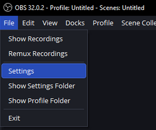

Under the Replay Buffer section, enable it and set your desired settings.

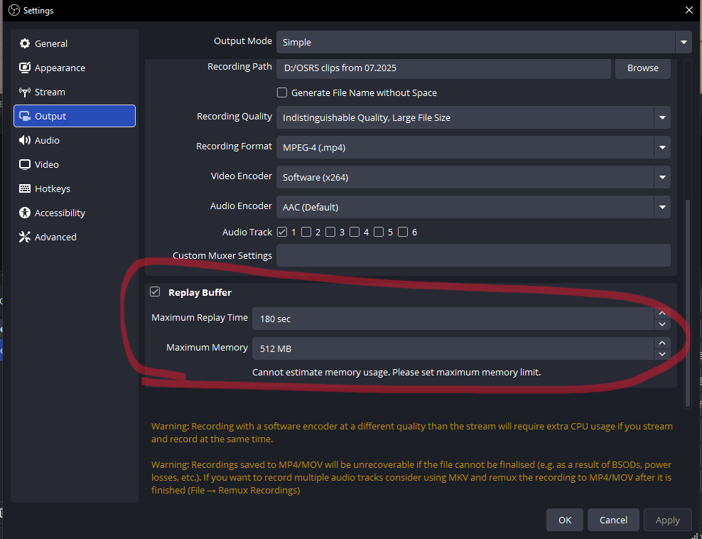

Maximum Replay Time (Shown in image above) determines how much earlier the clip starts from when you save it or when RuneLite takes a screenshot.

For example: If set to 3 minutes, the saved clip will include the 3 minutes before the save or screenshot.

Choose a duration that best suits your needs.

### 4. Enable OBS WebSocket Server (with Authentication)

In OBS, go to Tools → WebSocket Server Settings.

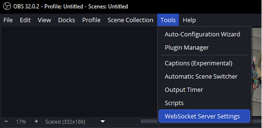

Check Enable Server.

Make sure Enable Authentication is ticked.

Click Generate Password.

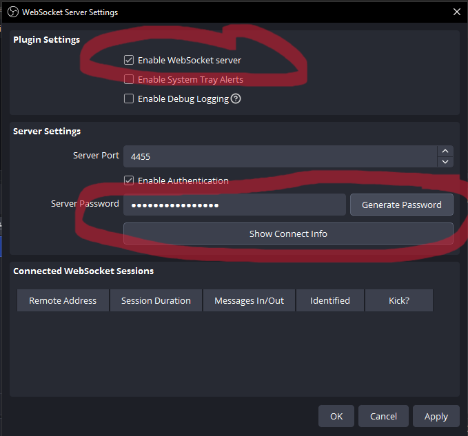

Click "Show Connect Info" button and copy your Server Password.

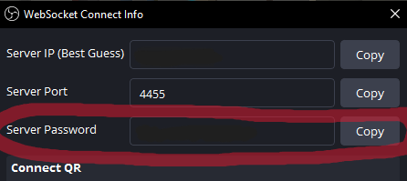

### 5. Connect the Plugin to OBS

In RuneLite, open the Replay Buffer plugin settings (click the ⚙️ cog icon).

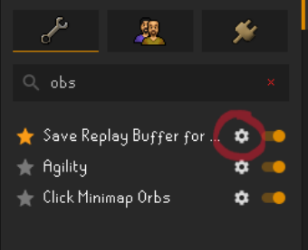

Paste the password you copied from OBS into the plugin.

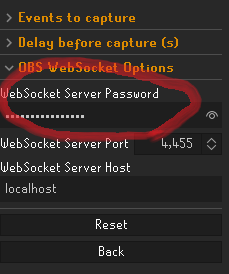

> Note the plugin will attempt to reconnect whenever the configuration values change, but this may require leaving the input box
> Alternatively, have you tried turning it off and on again?

If everything is set up correctly, you’ll see a successful connection in your OBS WebSocket settings.

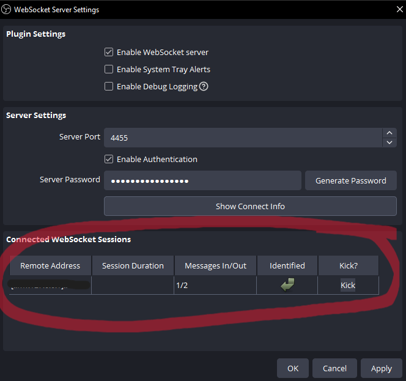

### 6. Optional: Fine-Tune Replay Timing

You can add a delay before saving the replay to include action happening after the moment a screenshot would be taken in Runelite.

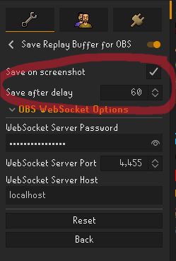

Example: Replay Buffer: 3 minutes

“Save After Delay” setting: 1 minute
Your clip will include 2 minutes before and 1 minute after the trigger (such as a RuneLite screenshot).

### 7. When Clips Are Saved

A clip is automatically saved when RuneLite takes a screenshot.

Any option in the RuneLite Screenshot plugin that is ticked trigger a clip to save.

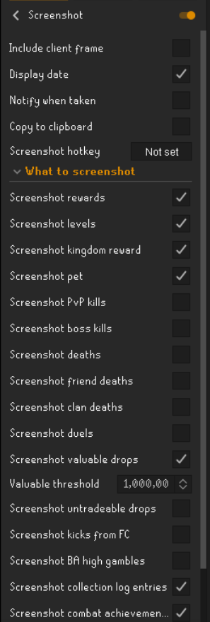